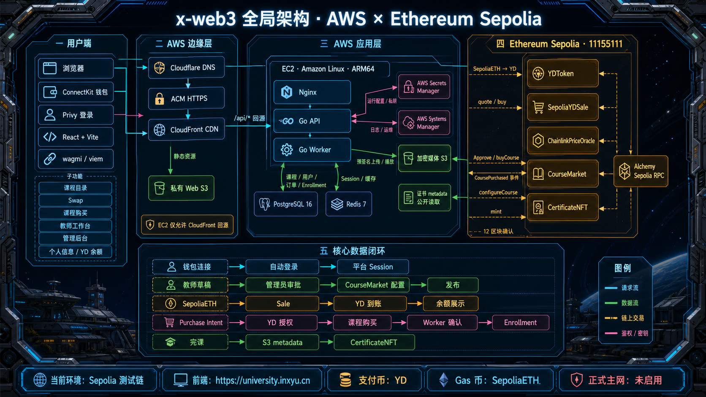
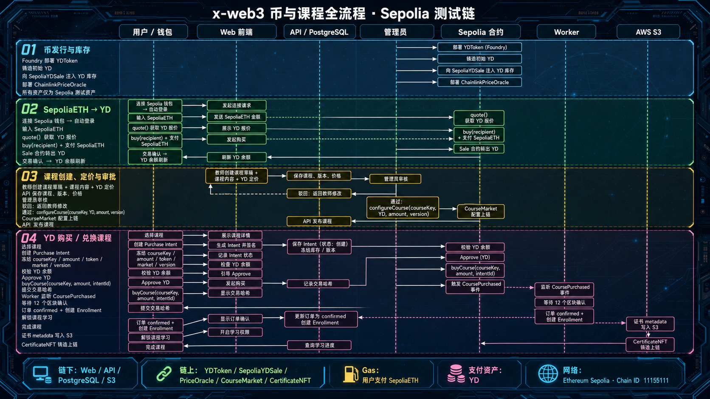

# x-web3 · Web3 University

x-web3 是一个运行在 **Ethereum Sepolia 测试链**上的 Web3 课程平台。项目把传统课程系统与链上支付结合起来，覆盖钱包登录、YD 测试币兑换、课程创建与审批、YD 购买课程、链上事件确认、学习进度以及完课证书 NFT。

线上环境：<https://university.inxyu.cn>

> 当前只面向 Sepolia 测试链。SepoliaETH 与 YD 都是测试资产，不具有真实货币价值；项目尚未启用 Ethereum 主网，也没有进行交易所或 DEX“上币”。

## 1. 项目当前实现

### 用户与钱包

- ConnectKit 负责浏览器钱包连接和网络切换。
- 钱包连接后自动进入登录/注册流程，首次登录可以设置昵称。
- 平台账户、钱包绑定、昵称、角色和 Session 保存在链下系统。
- 账户菜单展示当前 Sepolia 网络、钱包地址和 YD 余额。
- 权限分为学生、教师与超级管理员。

### YD 与 Swap

- `YDToken` 是 Sepolia 上的 ERC-20 课程支付币，精度为 18 位。
- `SepoliaYDSale` 持有测试 YD 库存，接收 SepoliaETH 并转出 YD。
- Swap 页面调用 `quote()` 获取报价，再调用 `buy(recipient)` 完成兑换。
- 当前执行汇率来自 Sale 合约的 `ydPerEth` 固定参数。
- `ChainlinkPriceOracle` 提供 ETH/USD 参考价格；它目前不直接决定 Swap 执行汇率。
- SepoliaETH 同时用于支付 Swap 输入和所有链上交易 Gas。

### 课程与审批

- 教师创建课程草稿、课程内容、版本与 YD 定价。
- API 将课程、课节、价格和审核状态保存到 PostgreSQL。
- 管理员可以驳回课程，或审批通过后调用 `CourseMarket.configureCourse(...)`。
- 链上配置成功后，API 将课程发布到公开目录。
- 课程审批同时保证链下价格与 CourseMarket 的 token、amount、version 一致。

### 课程购买与学习

- API 创建 Purchase Intent，冻结课程、`courseKey`、YD 金额、Token、Market 和价格版本。
- Web 检查钱包 YD 余额以及对 CourseMarket 的 allowance。
- allowance 不足时先调用 YD `approve()`，然后调用 `buyCourse()`。
- 前端将交易哈希提交给 API；Worker 监听 `CoursePurchased` 事件。
- 达到 12 个区块确认后，订单变为 `confirmed` 并创建 Enrollment。
- Enrollment 解锁课程播放、学习进度、评论和完课流程。

### 证书

- 完课数据由 API 生成 ERC-721 metadata。
- metadata 写入 AWS S3 的公开 `certificate-metadata/` 前缀。
- Worker 使用测试链签名账户调用 `CertificateNFT` 铸造不可转让的课程证书。
- 证书交易、确认状态与 tokenURI 回写 PostgreSQL。

## 2. 全局架构



### 请求与数据路径

1. 浏览器通过 Cloudflare DNS 访问 CloudFront，ACM 提供 HTTPS 证书。
2. CloudFront 从私有 Web S3 返回 Vite 静态资源，并将 `/api/*` 回源到 EC2 Nginx。
3. Nginx 将 API 请求转发给 Go API；EC2 的 80 端口只允许 CloudFront 回源网络访问。
4. API 使用 PostgreSQL 保存业务数据、Redis 保存 Session 与缓存，并通过预签名 URL 访问媒体 S3。
5. 浏览器使用 wagmi/viem 通过 Alchemy RPC 读取 Sepolia，并由用户钱包签名发送 Swap、Approve、课程购买和课程配置交易。
6. Worker 通过 Sepolia RPC 监听 CourseMarket 事件，推进订单和 Enrollment，并负责证书 NFT 铸造。
7. Secrets Manager 保存运行配置与测试链签名凭据，Systems Manager 用于无 SSH 部署和运维。

### 当前 AWS 拓扑

| 层级 | 当前实现 |
|---|---|
| DNS | Cloudflare DNS |
| HTTPS / CDN | ACM + CloudFront |
| Web | 私有 S3 静态站点 |
| API 回源 | CloudFront `/api/*` → EC2 Nginx → Go API |
| 后台任务 | EC2 systemd → Go Worker |
| 数据库 | EC2 Docker → PostgreSQL 16 |
| 缓存 | EC2 Docker → Redis 7 |
| 媒体 | 独立加密 S3；课程媒体私有、证书 metadata 前缀公开 |
| 配置 | AWS Secrets Manager |
| 运维 | AWS Systems Manager |
| 区块链 | Ethereum Sepolia，Chain ID `11155111` |

当前后端为测试环境的单节点部署。正式生产环境应进一步拆分托管数据库、托管 Redis、独立计算服务、监控告警、备份恢复以及 KMS/多签签名体系。

## 3. 币与课程主流程



### 3.1 币发行与测试库存

```text
Solidity 合约
  → Foundry 编译与测试
  → 部署 YDToken 到 Sepolia
  → 铸造初始 YD
  → 部署 SepoliaYDSale
  → 向 Sale 转入 YD 测试库存
  → 前端登记公开合约地址与 ABI
```

这里的“上币”只表示在 Sepolia 部署 ERC-20，并向项目自己的 Sale 合约注入兑换库存；不包含主网发行、Uniswap 建池、流动性管理、CEX 上币或法币出入金。

### 3.2 SepoliaETH 兑换 YD

```text
连接钱包并自动登录
  → 输入 SepoliaETH
  → Sale.quote() 返回 YD 数量
  → 用户钱包签名 buy(recipient)
  → Sale 收到 SepoliaETH
  → Sale 向用户转出 YD
  → 交易确认
  → 账户菜单刷新 YD 余额
```

### 3.3 课程创建、审批与发布

```text
教师创建草稿、内容和 YD 定价
  → API 保存课程、版本和价格
  → 管理员审核
      ├─ 驳回 → 教师修改后重新提交
      └─ 通过 → 钱包签名 configureCourse(courseKey, YD, amount, version)
                    → CourseMarket 配置上链
                    → API 发布课程
```

### 3.4 使用 YD 购买课程

```text
选择课程
  → API 创建 Purchase Intent
  → 冻结 courseKey / amount / token / market / version
  → 检查 YD balanceOf
  → allowance 不足时 approve(CourseMarket, amount)
  → buyCourse(courseKey, amount, intentId)
  → 前端提交交易哈希给 API
  → Worker 监听 CoursePurchased
  → 等待 12 个区块确认
  → Order confirmed
  → 创建 Enrollment
  → 解锁课程
```

### 3.5 完课与证书

```text
完成课程
  → API 生成证书 metadata
  → metadata 写入 S3
  → 创建证书铸造任务
  → Worker 调用 CertificateNFT
  → 等待链上确认
  → 保存 NFT tokenId / tokenURI / txHash
```

## 4. 链上合约

当前 Web/AWS 环境使用以下 Sepolia 合约：

| 合约 | 职责 | 当前地址 |
|---|---|---|
| `YDToken` | ERC-20 课程支付币 | `0xDaBC07723e43a3dd1806b9253B1DB1c5C221FD24` |
| `SepoliaYDSale` | SepoliaETH → YD 测试兑换 | `0x5107Cc7F55218BE95ee3C6086D4E77fF2B618ff0` |
| `ChainlinkPriceOracle` | ETH/USD 参考价格与数据新鲜度校验 | `0xD9aab1420117cdF2e8cCFE0b4E4812FC9672763B` |
| `CourseMarket` | 课程价格配置、YD 扣款和购买事件 | `0x232Cc6159f0aF5F6CfEC0878c68F8ACaA71F3ffD` |
| `CertificateNFT` | 不可转让的完课证书 | `0x81a0F06EbBf4557bb2C682550325a2A6bB0AA5E1` |

公开地址可以放入 `VITE_*` 环境变量；RPC key、Session secret、数据库密码和签名私钥不得进入 Git 或前端 bundle。

## 5. Monorepo 结构

```text
x-web3/
├── apps/
│   ├── web/                 # React 18 + Vite + ConnectKit + wagmi/viem
│   ├── api/                 # Go HTTP API：认证、课程、订单、媒体、学习、证书、管理后台
│   └── worker/              # Go Worker：链事件索引、订单确认、证书铸造、监控
├── packages/
│   ├── contracts/           # Foundry、Solidity 合约、部署脚本、测试和 ABI 导出
│   └── shared/              # OpenAPI、跨端事件和共享契约
├── database/
│   ├── migrations/          # PostgreSQL schema migrations
│   └── seed/                # 本地与测试数据
├── infra/aws/               # Web 与后端 CloudFormation 模板
├── deploy/                  # Docker Compose 与本地/部署环境配置模板
├── scripts/                 # AWS 部署、Cloudflare DNS、ABI/OpenAPI 检查脚本
├── docs/
│   ├── adr/                 # 架构决策记录
│   ├── dev/                 # Anvil 等开发闭环
│   ├── runbooks/            # 链回放、备份、签名轮换、故障演练
│   └── assets/              # README 与架构文档图片
├── design-system/           # 产品视觉与组件设计参考
└── specs/                   # 产品和功能规格
```

### Web 主要模块

| 路径 | 内容 |
|---|---|
| `apps/web/src/auth` | 钱包自动登录、Session、鉴权保护 |
| `apps/web/src/features/catalog` | 课程目录、详情和评论 |
| `apps/web/src/features/swap` | SepoliaETH → YD |
| `apps/web/src/features/checkout` | Purchase Intent、YD 授权和课程购买 |
| `apps/web/src/features/teacher` | 课程编辑和教师工作台 |
| `apps/web/src/features/admin` | 课程审核、用户和系统管理 |
| `apps/web/src/features/account` | 订单、课程、证书、评论和账户菜单 |
| `apps/web/src/features/learning` | 播放、进度和完课流程 |
| `apps/web/src/contracts` | ABI、部署地址和链上调用定义 |

### API 主要领域

| 领域 | 职责 |
|---|---|
| `auth` / `wallet` / `user` / `rbac` | 登录、钱包绑定、用户资料和权限 |
| `course` / `catalog` / `review` | 课程、目录和审批 |
| `order` | Purchase Intent、交易提交和订单查询 |
| `media` / `objectstore` | S3 预签名上传、对象确认和播放地址 |
| `learning` / `comment` | Enrollment、学习进度和评论 |
| `certificate` | 证书 metadata 与铸造任务 |
| `admin` / `audit` | 管理接口、DLQ、审计和链状态 |

## 6. 技术栈

| 层级 | 技术 |
|---|---|
| Web | TypeScript、React 18、Vite 5、React Router、ConnectKit、wagmi v2、viem v2、TanStack Query |
| API | Go、Gin、pgx、go-redis、Privy JWT/平台 Session |
| Worker | Go、go-ethereum、Sepolia JSON-RPC、PostgreSQL |
| Contract | Solidity 0.8.24、Foundry、OpenZeppelin |
| Data | PostgreSQL 16、Redis 7、AWS S3 |
| AWS | CloudFormation、CloudFront、ACM、S3、EC2、Secrets Manager、Systems Manager |
| Tooling | pnpm workspace、Vitest、Playwright、Forge Test |

## 7. 本地开发

### 前置工具

| 工具 | 建议版本 |
|---|---|
| Node.js | 20+ |
| pnpm | 10.x |
| Go | 1.24+；以各 Go module 的 `go.mod` 为准 |
| Foundry | 最新稳定版 |
| Docker | 支持 Docker Compose |
| PostgreSQL | 16；也可使用现有本地实例 |

### 初始化

```bash
pnpm install

cp .env.example .env
cp apps/web/.env.example apps/web/.env
cp packages/contracts/.env.example packages/contracts/.env
```

不要提交 `.env`。本地数据库、RPC、Privy、Session 和测试签名配置均通过环境变量注入。

### 启动服务

```bash
# Web
pnpm dev

# API
pnpm api:dev

# Worker
pnpm worker:dev

# 可选：启动 compose 中的 Redis 与 Anvil，再启动 API
pnpm dev:stack
```

数据库迁移：

```bash
pnpm db:migrate
pnpm db:rollback
```

本地 Anvil 完整闭环参见 [docs/dev/anvil-loop.md](docs/dev/anvil-loop.md)。

## 8. 测试与质量检查

```bash
# 全 workspace
pnpm test
pnpm typecheck
pnpm lint

# Web
pnpm --filter @x-web3/web test
pnpm --filter @x-web3/web build
pnpm e2e:web

# API / Worker
pnpm api:test
pnpm worker:test

# Solidity
pnpm contracts:compile
pnpm contracts:test

# OpenAPI
pnpm openapi:check
```

## 9. 合约开发与部署

```text
Solidity 源码
  → forge build / forge test
  → forge script --broadcast --verify
  → Sepolia 合约
  → export-abi.mjs
  → apps/web/src/contracts/*.abi.ts
  → VITE_* 合约地址
  → React + wagmi/viem
```

常用命令：

```bash
pnpm contracts:compile
pnpm contracts:test
pnpm contracts:deploy:sepolia
pnpm contracts:verify:sepolia
pnpm contracts:export:abi
```

合约重新部署后必须同步：

1. 前端 `VITE_*` 地址配置。
2. API/Worker 的运行配置。
3. ABI 导出文件。
4. [docs/DEPLOYMENTS.md](docs/DEPLOYMENTS.md) 部署档案。
5. CourseMarket 的课程配置。

## 10. AWS 部署

```bash
# 发布 Web、更新 CloudFront 并执行缓存失效
pnpm deploy:aws

# 构建并发布 API / Worker
bash scripts/deploy-backend-aws.sh
```

AWS 模板：

- [infra/aws/static-site.yaml](infra/aws/static-site.yaml)：私有 Web S3、CloudFront、ACM 与 API 回源。
- [infra/aws/backend.yaml](infra/aws/backend.yaml)：EC2、IAM、安全组、媒体 S3、API 与 Worker。
- [docs/DEPLOYMENT.md](docs/DEPLOYMENT.md)：部署和域名配置说明。

## 11. 安全边界

- 永远不要提交私钥、助记词、RPC key、数据库密码或 Session secret。
- `VITE_*` 会进入浏览器 bundle，只能存放公开信息。
- 当前 Worker 使用 Sepolia 测试签名账户；正式链必须迁移到 AWS KMS、硬件钱包或多签流程。
- 管理员审批会触发链上配置，操作前必须核对链、合约地址、YD 金额和版本。
- 用户自己支付 Sepolia Gas；当前没有 Paymaster。
- CourseMarket、YD、Sale 和 CertificateNFT 均为测试链资产与合约。
- 正式主网上线前还需要安全审计、法务/合规评估、监控告警、灾备与密钥轮换。

## 12. 相关文档

- [docs/ARCHITECTURE.md](docs/ARCHITECTURE.md)：合约、ABI、前端调用与 Sepolia 开发说明。
- [docs/PRODUCT-FLOWS.md](docs/PRODUCT-FLOWS.md)：产品页面与业务流程。
- [docs/TOOLCHAIN.md](docs/TOOLCHAIN.md)：Foundry、ABI、部署和验证工具链。
- [docs/DEPLOYMENTS.md](docs/DEPLOYMENTS.md)：公开合约部署档案。
- [docs/DEPLOYMENT.md](docs/DEPLOYMENT.md)：AWS 与域名部署。
- [docs/adr/](docs/adr/)：链、代币、预言机、视频和前端技术选型。
- [docs/runbooks/](docs/runbooks/)：备份恢复、链回放、签名轮换与故障演练。
